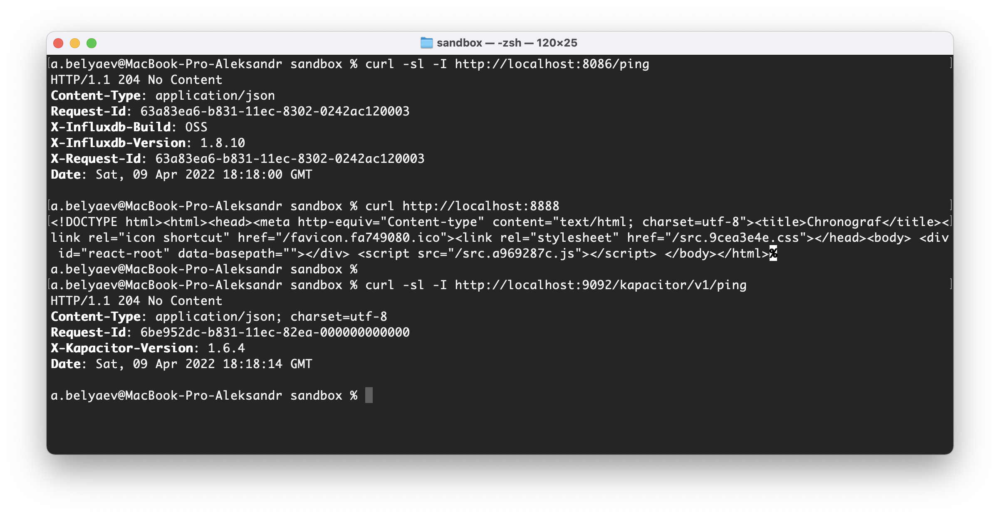
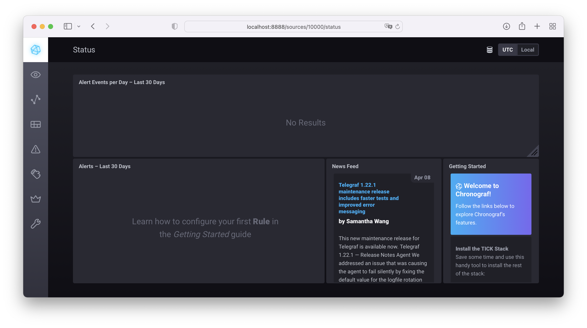
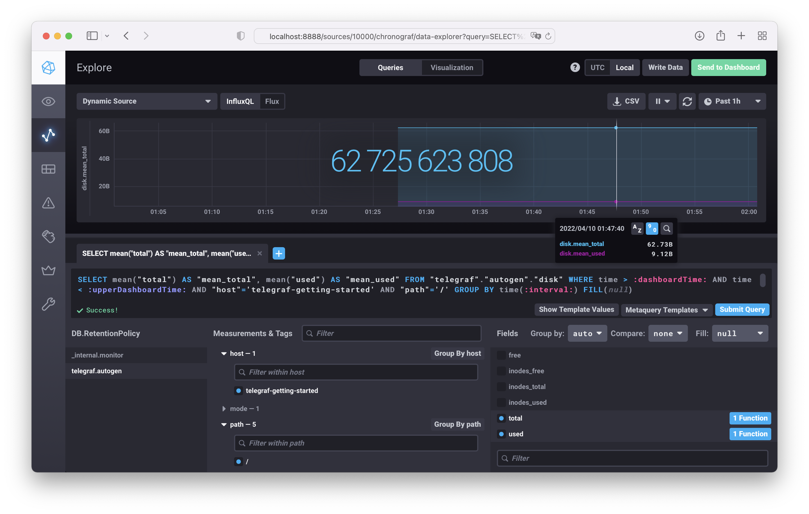

# 10.02. Системы мониторинга  

## Задача 1

Основные плюсы и минусы pull и push систем мониторинга.  

### Pull  
Плюсы:
- легче контролировать данные, т.е. известно кто откуда что передает, настраивается в единой точке
- можно самостоятельно запрашивать данные, используя ПО вне системы мониторинга посредствам HTTP
- можем разнести систему мониторинга и агенты, с гарантией безопасности их взаимодействия используя единый Proxy-server
- возможность контролировать количество собираемых метрик

### Push  
  
Плюсы:
- с одного агента можно отправлять данные в несколько систем
- более гибкая настройка на каждом клиенте, объем данных и частота отправки
- динамика, добавление новых инстансов с заранее настроенным агентом автоматом добавит метрику без настройки системы мониторинга
- при использовании UDP, может вырасти производительность сбора метрик
- наблюдение за сервисами, защищёнными фаерволлом
- также механизм push может оказаться полезным при наблюдении за сервисами, подключающихся к сети периодически и на непродолжительное время.  

Минусы:
- гарантия доставки пакетов
- каждый агент должен знать эндпоинт для отправки метрики, при изменении придется менять на всех хостах
- не можем контролировать качество и количество метрик без дополнительного прокси

## Задача 2  

Какие из ниже перечисленных систем относятся к push модели, а какие к pull? А может есть гибридные?  
* Prometheus - Pull модель, но есть возможность пушить метрики через отдельный компонент Pushgateway
* TICK - Push модель
* Zabbix -  гибридный, Push и Pull
* VictoriaMetrics - совместим со всеми популярными протоколами приёма данных, vmagent поддерживает обе модели, и Push и Pull
* Nagios - способен контролировать хосты двумя способами, активно и пассивно, т.е. Pull и Push модель

## Задача 3  

Запуск TICK-стэка из [репозитория](https://github.com/influxdata/sandbox/tree/master).  

## Задача 4  

Метрики `disk` в веб-интерфейсе Chronograf  

## Задача 5  

