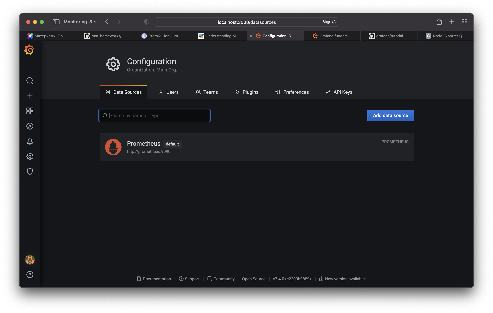
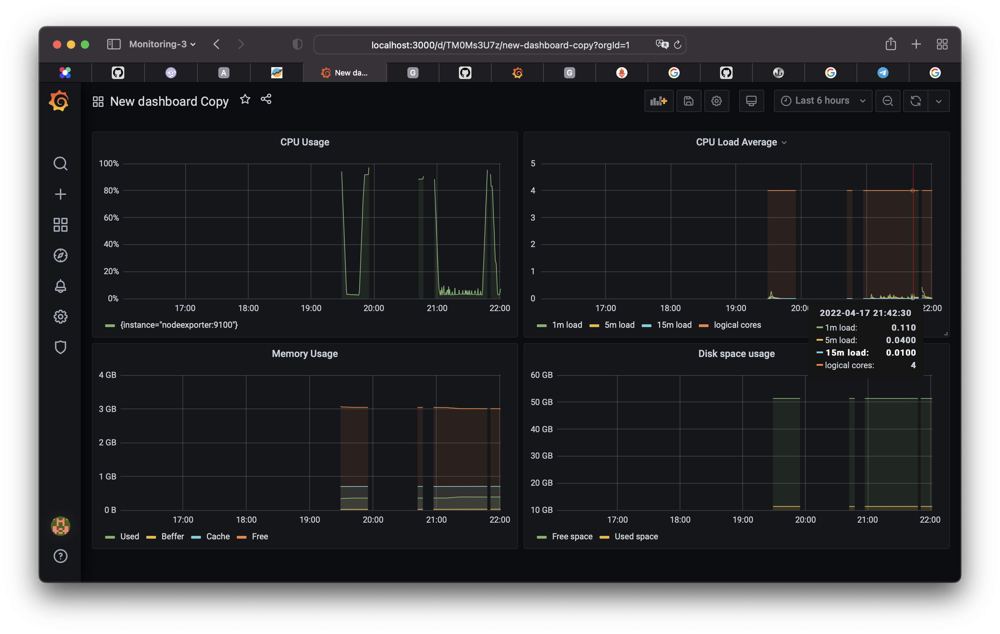

# 10.03. Grafana  

## Задание 1  

Запуск связки prometheus-grafana через [docker-compose](help/docker-compose.yml).  


## Задание 2

Создание Dashboard и следующие Panels:

* Утилизация CPU для nodeexporter (в процентах, 100-idle)  
  ```
  100 - (avg by (instance)(rate(node_cpu_seconds_total{mode="idle"}[5m]))*100)
  ```
* CPULA 1/5/15
  ```
  node_load1
  node_load5
  node_load15
  count(node_cpu_seconds_total{mode="idle"}) # посчитаем кол-во ядер
  ```
* Количество свободной оперативной памяти
  ```
  node_memory_MemFree_bytes
  ```
* Объем используемой оперативной памяти
  ```
  node_memory_MemTotal_bytes - node_memory_MemFree_bytes
  ```
* Количество места на файловой системе
  ```
  node_filesystem_avail_bytes{fstype="ext4"} # свободно
  node_filesystem_size_bytes{fstype="ext4"} - node_filesystem_avail_bytes{fstype="ext4"} # занято
  ```
  


## Задание 3

