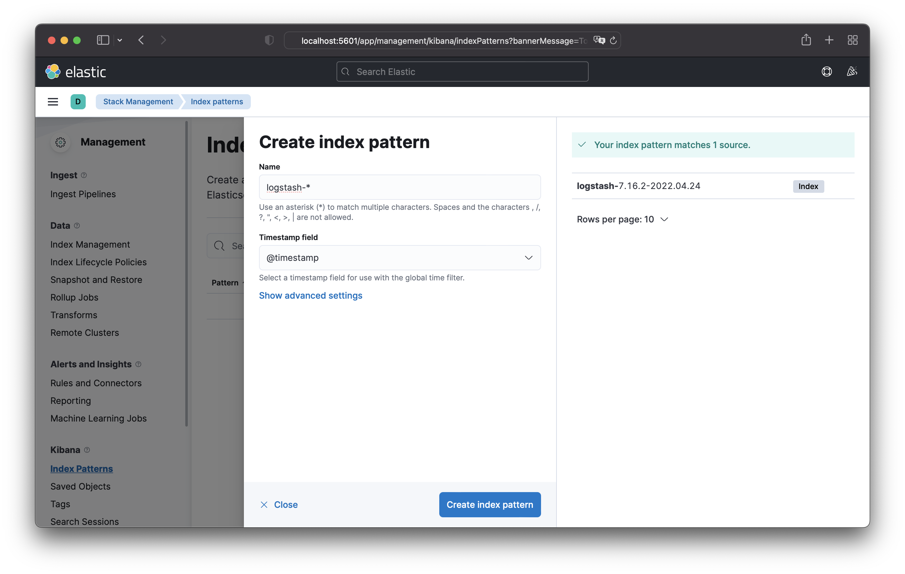
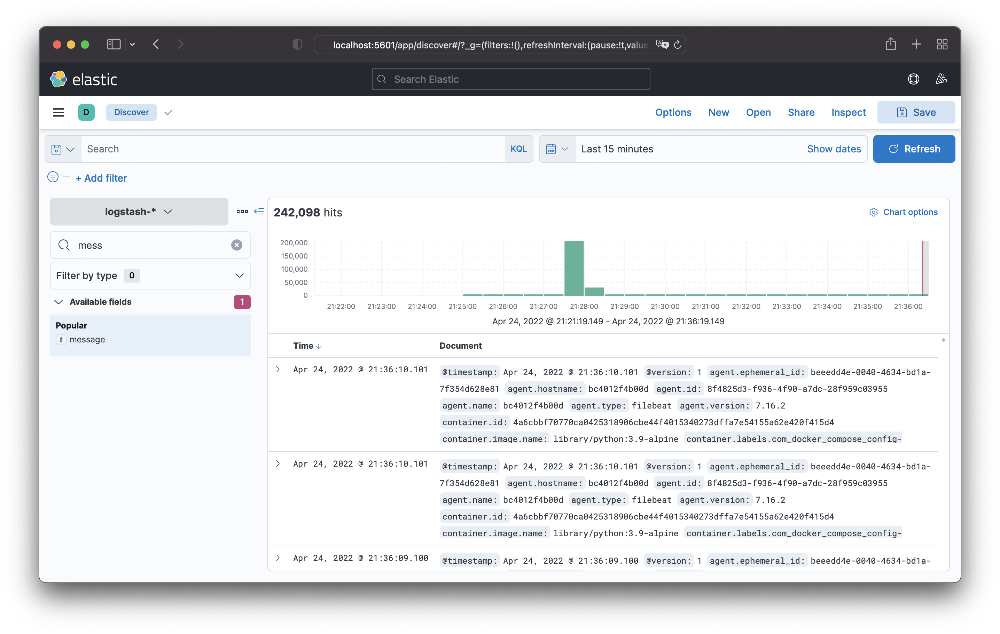
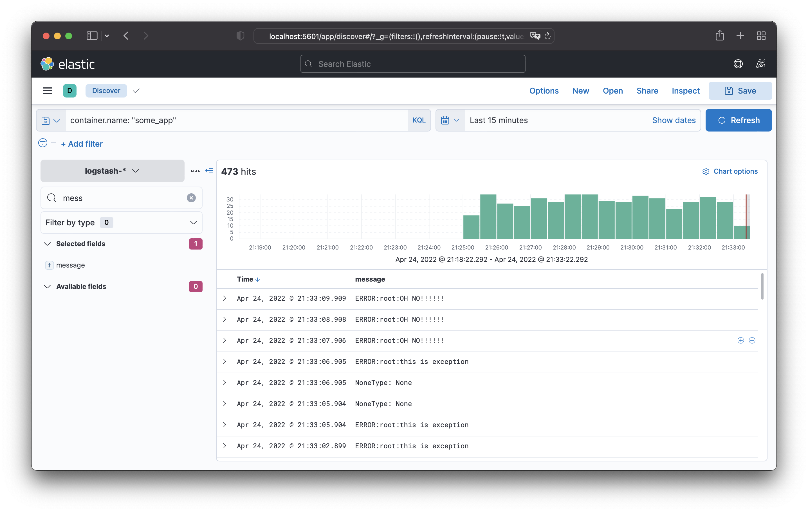

# 10.04. ELK  

## Задача 1  

Необходимо поднять в докере:

* elasticsearch(hot и warm ноды)
* logstash
* kibana
* filebeat

и связать их между собой.  

  

Интерфейс кибаны:
  

## Задача 2  

Создание index-patterns в kibana:  
  
Просмотр логов в kibana (Discover):  
  
Выборка логов контейнера с run.py:  
  

Исходники [здесь](help)